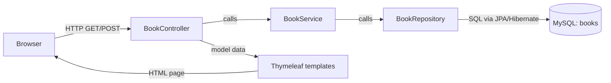
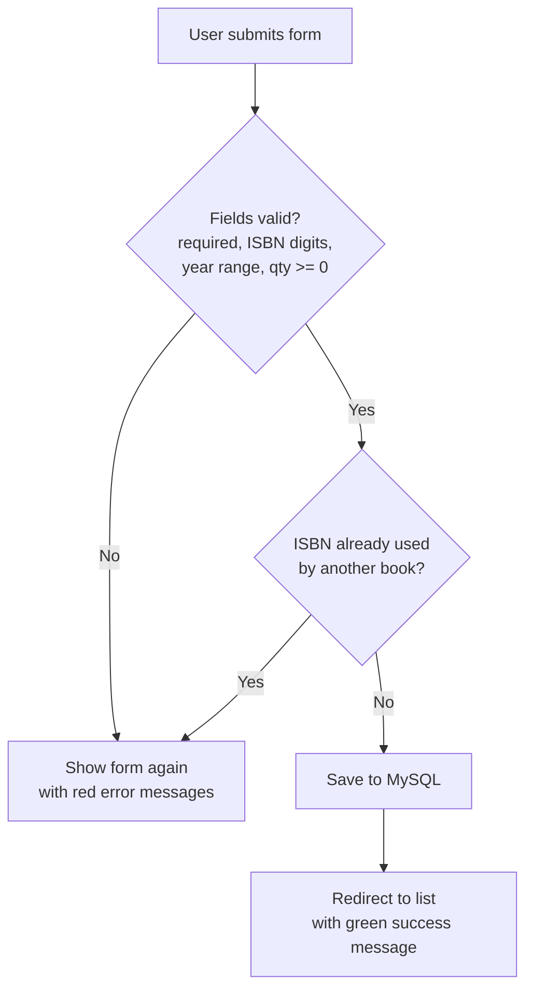
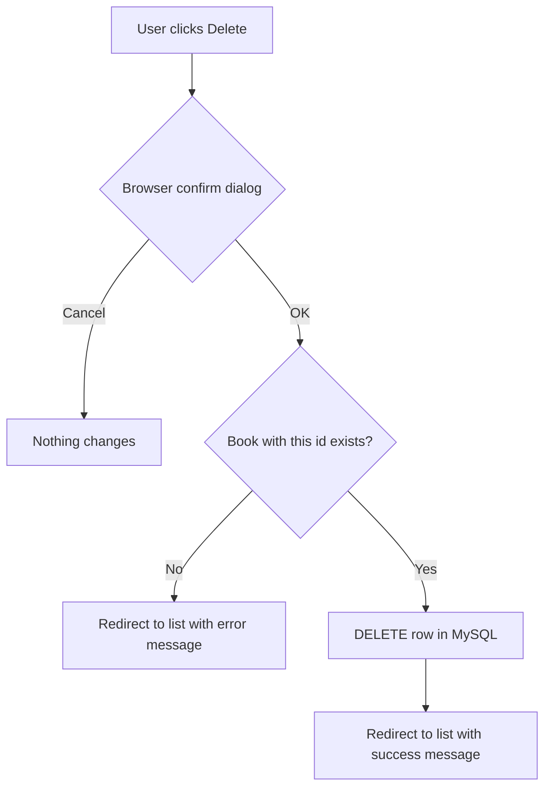

# Library Inventory System of company "ABC"

Course paper 3 (DAT1080P), topic **#4 – Library inventory system of company "ABC"**.

A small web application for the librarians of company "ABC". It keeps a list of books
in stock and supports all four CRUD operations: **Create**, **Read** (list, search),
**Update** and **Delete**.

| Part | Technology |
|---|---|
| Language | Java 21 (OpenJDK) |
| Framework | Spring Boot 3.5 (Web MVC, Data JPA, Validation) |
| Pages | Thymeleaf templates + one plain CSS file |
| Database | MySQL 8.4 |
| Build | Maven |
| Containers | Docker Compose |
| IDE | IntelliJ IDEA |
| Tests | JUnit 5 + Mockito |

---

## 1. Project structure

```
library-inventory/
├── pom.xml                         Maven build file, dependencies
├── Dockerfile                      builds the app image (2 stages)
├── docker-compose.yml              MySQL + app containers
├── docker/mysql/init.sql           table + sample data (runs on first DB start)
└── src/
    ├── main/java/lv/turiba/library/
    │   ├── LibraryApplication.java         entry point (main method)
    │   ├── model/Book.java                 entity = row in "books" table
    │   ├── repository/BookRepository.java  database access (Spring Data JPA)
    │   ├── service/BookService.java        CRUD business logic
    │   ├── service/BookNotFoundException.java
    │   ├── service/DuplicateIsbnException.java
    │   └── controller/
    │       ├── BookController.java         URLs -> service -> HTML page
    │       └── HomeController.java         "/" redirects to "/books"
    ├── main/resources/
    │   ├── application.properties          DB connection settings
    │   ├── templates/books/list.html       list + search page
    │   ├── templates/books/form.html       add / edit form
    │   └── static/css/style.css            styling
    └── test/java/lv/turiba/library/service/
        └── BookServiceTest.java            unit tests
```

## 2. Architecture (programming model)

The application uses a classic three-layer MVC structure. Each layer only talks to the one below it.



### Database model

Table `books`:

| Column | Type | Rule |
|---|---|---|
| id | BIGINT | primary key, auto increment |
| title | VARCHAR(200) | required |
| author | VARCHAR(150) | required |
| isbn | VARCHAR(13) | required, unique, 10 or 13 digits |
| genre | VARCHAR(50) | required |
| published_year | INT | 1450 – 2100 |
| quantity | INT | 0 or more |
| shelf_location | VARCHAR(20) | required, e.g. `A-01` |

### URL map (CRUD)

| Operation | Method | URL | What happens |
|---|---|---|---|
| Read (list/search) | GET | `/books?search=text` | shows all books, or those whose title/author contains the text |
| Create – form | GET | `/books/new` | empty form |
| Create – save | POST | `/books` | validates and inserts the book |
| Update – form | GET | `/books/{id}/edit` | form filled with current data |
| Update – save | POST | `/books/{id}` | validates and updates the book |
| Delete | POST | `/books/{id}/delete` | removes the book after browser confirmation |

## 3. Algorithm (flowchart of saving a book)

Create and Update follow the same steps:



Delete:



---

## 4. Step-by-step setup

### Step 1 – Install the software

1. **IntelliJ IDEA** (Community edition is enough): https://www.jetbrains.com/idea/download/
2. **JDK 21** – can be downloaded directly from IntelliJ in step 3, or from https://adoptium.net
3. **Docker Desktop**: https://www.docker.com/products/docker-desktop/ – start it and wait until it says *Engine running*.

Maven does not need to be installed separately – IntelliJ has it built in.

### Step 2 – Open the project in IntelliJ

1. Unzip `library-inventory.zip`.
2. IntelliJ → **File → Open…** → select the `library-inventory` folder (the one containing `pom.xml`) → **Open** → **Trust Project**.
3. IntelliJ detects Maven and downloads dependencies (progress bar at the bottom right). Wait until it finishes.

### Step 3 – Set the JDK

1. **File → Project Structure → Project**.
2. **SDK**: choose a version 21 JDK. If there is none: **Add SDK → Download JDK → Version 21 → any vendor (e.g. Eclipse Temurin)**.
3. **Language level**: 21. Click **OK**.

### Step 4 – Start the MySQL database with Docker Compose

Open the terminal inside IntelliJ (**View → Tool Windows → Terminal**) and run:

```bash
docker compose up -d db
```

What this does:
- downloads the `mysql:8.4` image (first time only),
- creates database `library_db` and user `library_user` / `library_pass`,
- runs `docker/mysql/init.sql`, which creates the `books` table and inserts 8 sample books,
- publishes MySQL on `localhost:3307`.

Check that it is healthy:

```bash
docker compose ps
```

The `library-db` line must show `healthy` (takes 10–30 seconds on the first start).

> MySQL is published on host port **3307** (not the default 3306), so it does not clash
> with a MySQL server that may already be installed on your computer. Inside Docker the
> app still talks to the database on port 3306.

### Step 5 – Run the application from IntelliJ

1. Open `src/main/java/lv/turiba/library/LibraryApplication.java`.
2. Click the green ▶ arrow next to `public class LibraryApplication` → **Run 'LibraryApplication'**.
3. Wait for the log line `Started LibraryApplication in … seconds`.
4. Open **http://localhost:8080** in Chrome or Firefox.

### Step 6 – (Alternative) Run everything in Docker

The whole system (database + application) can be started with one command, without IntelliJ.
This is the "can be run by anyone" option from the course requirements:

```bash
docker compose --profile full up -d --build
```

Open **http://localhost:8080**. Stop with:

```bash
docker compose --profile full down
```

If the app from step 5 is still running in IntelliJ, stop it first (both use port 8080).

### Step 7 – Run the tests

In IntelliJ: right-click `src/test/java` → **Run 'All Tests'**.
Or in the terminal: `mvn test` (IntelliJ: **Maven tool window → Lifecycle → test**).

The tests do not need the database – the repository is replaced with a Mockito mock.

### Step 8 – Useful Docker commands

| Command | Purpose |
|---|---|
| `docker compose up -d db` | start only MySQL |
| `docker compose stop` | stop containers, keep data |
| `docker compose down` | remove containers, keep data (volume stays) |
| `docker compose down -v` | remove containers **and data**; next start re-runs `init.sql` |
| `docker exec -it library-db mysql -ulibrary_user -plibrary_pass library_db` | open MySQL console |
| `SELECT * FROM books;` | (inside console) view the table |

---

## 5. User manual

**List of books.** The start page shows all books sorted by title, the number of titles and
the total number of copies. A quantity of `0` is shown in red (out of stock).

**Search.** Type part of a title or author name (e.g. `java`, `orwell`) and press *Search*.
Search is not case sensitive. *Clear* returns to the full list.

**Add a book.** Click *Add book*, fill in all fields, click *Save*.
- ISBN: only digits, 10 or 13 of them, no dashes (e.g. `9780132350884`).
- Year: between 1450 and 2100.
- Quantity: 0 or more.

If something is wrong, the form stays open and the problem is shown in red under the field.

**Edit a book.** Click *Edit* in the book's row, change the values, click *Save*.

**Delete a book.** Click *Delete* in the book's row and confirm in the dialog.

---

## 6. Test cases (for the Testing chapter)

Automated unit tests (`BookServiceTest`):

| # | Test | Expected result |
|---|---|---|
| 1 | createSavesNewBook | new book is saved |
| 2 | createRejectsDuplicateIsbn | error, nothing saved |
| 3 | findAllWithoutSearchReturnsEverything | blank search returns full list |
| 4 | findAllWithSearchUsesFilter | search text is trimmed and filtered |
| 5 | findByIdThrowsWhenMissing | "not found" error |
| 6 | updateChangesFields | quantity and shelf are changed |
| 7 | deleteRemovesExistingBook | repository delete is called |
| 8 | totalCopiesSumsQuantities | 2 + 5 = 7 |

Suggested manual (beta) test checklist – take screenshots for the report:

| # | Action | Expected result |
|---|---|---|
| M1 | Open http://localhost:8080 | list with 8 sample books |
| M2 | Search `java` | 2 books (Head First Java, Java: A Beginner's Guide) |
| M3 | Add a valid new book | green message, book appears in list |
| M4 | Save the form empty | red "… is required" messages |
| M5 | ISBN `12-34` | "ISBN must contain 10 or 13 digits" |
| M6 | ISBN of an existing book | "A book with ISBN … already exists" |
| M7 | Quantity `-1` | "Quantity cannot be negative" |
| M8 | Edit quantity to 0 | quantity shown in red |
| M9 | Delete → Cancel | book stays |
| M10 | Delete → OK | green message, book removed |
| M11 | Restart app, reload page | changes are still there (stored in MySQL) |

---

## 7. How the code covers the course requirements

| Requirement (syllabus) | Where |
|---|---|
| Software solution in Java | `src/main/java` |
| Structured, logical solution | three layers: controller → service → repository |
| Solution process: flowchart, algorithm, programming model | sections 2 and 3 of this file |
| Reusable code that can be run by anyone | `docker compose --profile full up -d --build` |
| Testing, manual for simple users | sections 5 and 6, `BookServiceTest` |
| Attachments with working code | this project folder |
