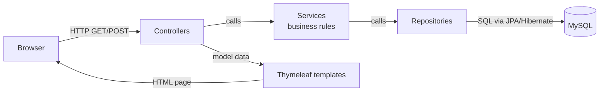
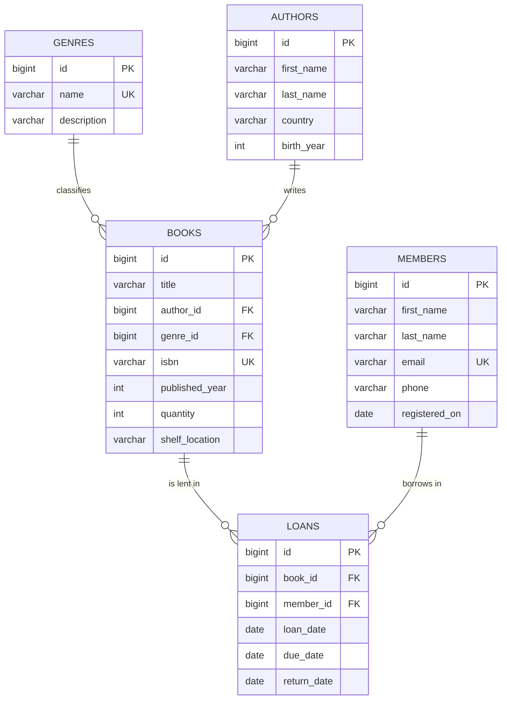
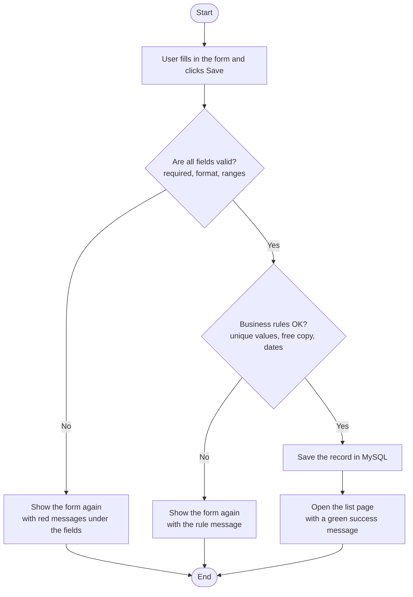
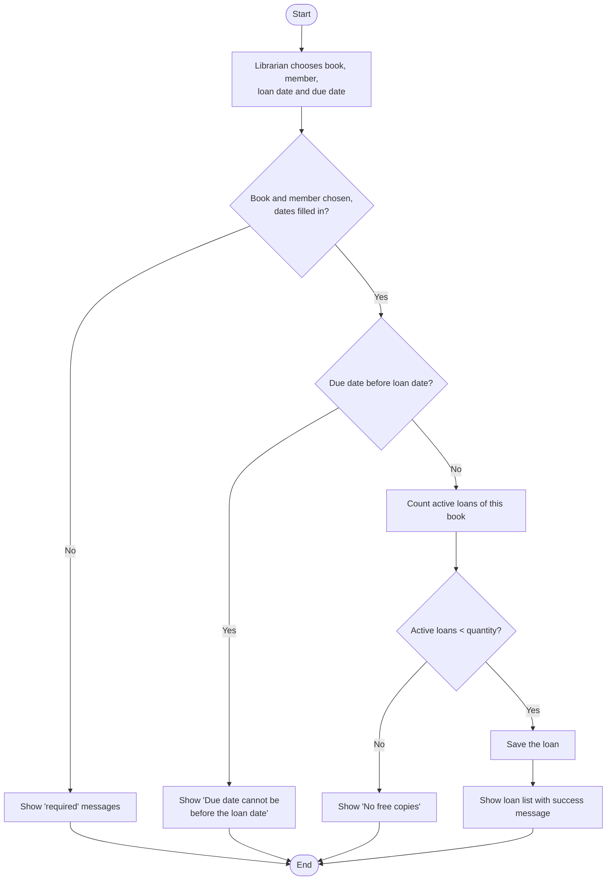
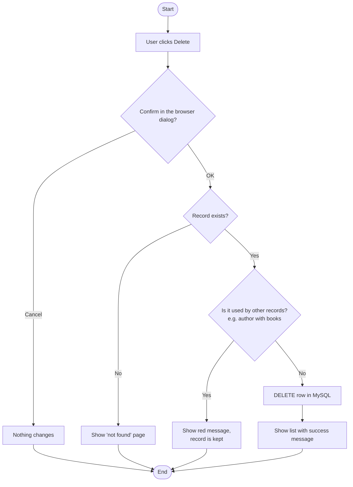
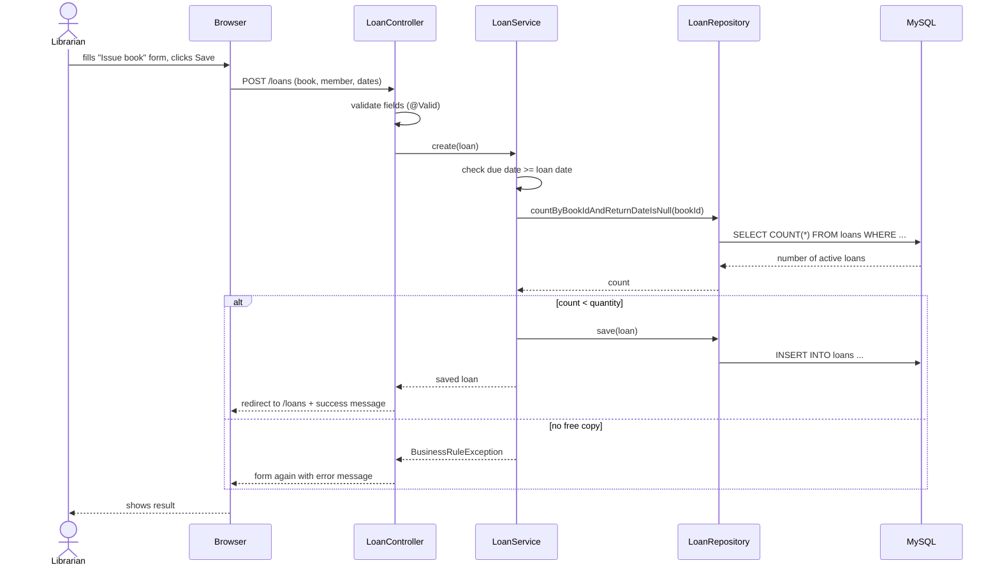

# Library Inventory System of company "ABC"

Course paper 3 (DAT1080P), topic **#4 – Library inventory system of company "ABC"**.

A web application for the librarians of company "ABC". It keeps the book inventory
(books, authors, genres), the list of registered readers (members) and the loans
(which member has which book and until when). Every one of the five entities supports
all four CRUD operations: **Create**, **Read**, **Update**, **Delete**.

| Part | Technology |
|---|---|
| Language | Java 21 (OpenJDK) |
| Framework | Spring Boot 3.5 (Web MVC, Data JPA, Validation) |
| Pages | Thymeleaf templates + one plain CSS file |
| Database | MySQL 8.4 |
| Build | Maven |
| Containers | Docker Compose |
| IDE | IntelliJ IDEA |
| Tests | JUnit 5 + Mockito |

---

## 1. Project structure

```
library-inventory/
├── pom.xml                         Maven build file, dependencies
├── Dockerfile                      builds the app image (2 stages)
├── docker-compose.yml              MySQL + app containers
├── docker/mysql/init.sql           5 tables + sample data (runs on first DB start)
└── src/
    ├── main/java/lv/turiba/library/
    │   ├── LibraryApplication.java         entry point (main method)
    │   ├── model/                          entities = tables
    │   │   ├── Genre.java  Author.java  Book.java  Member.java  Loan.java
    │   ├── repository/                     database access (Spring Data JPA)
    │   │   └── GenreRepository … LoanRepository
    │   ├── service/                        business rules for CRUD
    │   │   ├── GenreService … LoanService
    │   │   ├── NotFoundException.java      id does not exist
    │   │   └── BusinessRuleException.java  rule broken (duplicate, no free copy, …)
    │   └── controller/                     URLs -> service -> HTML page
    │       ├── GenreController … LoanController
    │       ├── HomeController.java         "/" redirects to "/books"
    │       ├── FormErrors.java             shows rule errors on the form
    │       └── GlobalExceptionHandler.java "not found" page
    ├── main/resources/
    │   ├── application.properties          DB connection settings
    │   ├── templates/fragments/layout.html shared head, navigation, messages
    │   ├── templates/<entity>/list.html    table page for each entity
    │   ├── templates/<entity>/form.html    add / edit form for each entity
    │   └── static/css/style.css            styling
    └── test/java/lv/turiba/library/service/
        ├── BookServiceTest.java
        ├── LoanServiceTest.java
        └── DeleteRulesTest.java
```

## 2. Architecture (programming model)

Three-layer MVC structure. Each layer only talks to the layer below it.



## 3. Data model (ER diagram)



Relationships: one genre has many books, one author has many books, one book can be
lent many times, one member can have many loans. A loan with an empty `return_date`
is an active loan (the copy is not in the library).

### Business rules

| Entity | Rule |
|---|---|
| Genre | name is unique; cannot be deleted while a book uses it |
| Author | cannot be deleted while the library has their books |
| Book | ISBN is unique (10 or 13 digits); quantity cannot be lower than copies on loan; cannot be deleted if it has loan records |
| Member | e-mail is unique; registration date defaults to today; cannot be deleted if they have loan records |
| Loan | due date and return date cannot be before the loan date; an active loan needs a free copy (active loans < quantity) |

### CRUD operations (URL map)

All five entities use the same pattern (`{entity}` = `books`, `authors`, `genres`, `members`, `loans`):

| Operation | Method | URL |
|---|---|---|
| Read (list) | GET | `/{entity}` (books also accept `?search=text`) |
| Create – form | GET | `/{entity}/new` |
| Create – save | POST | `/{entity}` |
| Update – form | GET | `/{entity}/{id}/edit` |
| Update – save | POST | `/{entity}/{id}` |
| Delete | POST | `/{entity}/{id}/delete` |
| Return a book (loans only) | POST | `/loans/{id}/return` |

## 4. Algorithms (flowcharts)

Every path starts at **Start** and finishes at **End**.

### 4.1 Saving a record (Create / Update, all entities)



### 4.2 Issuing a book (Create loan)



### 4.3 Deleting a record



## 5. Sequence diagram – issuing a book



---

## 6. Step-by-step setup

### Step 1 – Install the software

1. **IntelliJ IDEA** (Community edition is enough): https://www.jetbrains.com/idea/download/
2. **JDK 21** – can be downloaded directly from IntelliJ in step 3, or from https://adoptium.net
3. **Docker Desktop**: https://www.docker.com/products/docker-desktop/ – start it and wait until it says *Engine running*.
4. **Git**: https://git-scm.com/downloads

Maven does not need to be installed separately – IntelliJ has it built in.

### Step 2 – Get the code and open it in IntelliJ

```bash
git clone https://github.com/olegberz/library-inventory.git
```

IntelliJ → **File → Open…** → select the `library-inventory` folder (the one containing `pom.xml`)
→ **Open** → **Trust Project**. Wait until Maven finishes downloading dependencies
(progress bar at the bottom right).

### Step 3 – Set the JDK

1. **File → Project Structure → Project**.
2. **SDK**: choose a version 21 JDK. If there is none: **Add SDK → Download JDK → Version 21 → any vendor (e.g. Eclipse Temurin)**.
3. **Language level**: 21. Click **OK**.

### Step 4 – Start the MySQL database with Docker Compose

Open the terminal inside IntelliJ (**View → Tool Windows → Terminal**) and run:

```bash
docker compose up -d db
```

What this does:
- downloads the `mysql:8.4` image (first time only),
- creates database `library_db` and user `library_user` / `library_pass`,
- runs `docker/mysql/init.sql`, which creates the 5 tables and fills them with sample data,
- publishes MySQL on `localhost:3307`.

Check that it is healthy:

```bash
docker compose ps
```

The `library-db` line must show `healthy` (takes 10–30 seconds on the first start).

> MySQL is published on host port **3307** (not the default 3306), so it does not clash
> with a MySQL server that may already be installed on your computer. Inside Docker the
> app still talks to the database on port 3306.

> `init.sql` runs only when the database volume is empty. After changing `init.sql`
> (or after updating from an older version of this project) reset the database with
> `docker compose down -v` and start it again.

### Step 5 – Run the application from IntelliJ

1. Open `src/main/java/lv/turiba/library/LibraryApplication.java`.
2. Click the green ▶ arrow next to `public class LibraryApplication` → **Run 'LibraryApplication'**.
3. Wait for the log line `Started LibraryApplication in … seconds`.
4. Open **http://localhost:8080** in Chrome or Firefox.

### Step 6 – (Alternative) Run everything in Docker

The whole system (database + application) starts with one command, without IntelliJ or Java.
Only Docker Desktop is needed – this is the "can be run by anyone" option:

```bash
docker compose --profile full up -d --build
```

Open **http://localhost:8080**. Stop with:

```bash
docker compose --profile full down
```

If the app from step 5 is still running in IntelliJ, stop it first (both use port 8080).

### Step 7 – Run the tests

In IntelliJ: right-click `src/test/java` → **Run 'All Tests'**.
Or in the terminal: `mvn test` (IntelliJ: **Maven tool window → Lifecycle → test**).

The tests do not need the database – repositories are replaced with Mockito mocks.

### Step 8 – Useful Docker commands

| Command | Purpose |
|---|---|
| `docker compose up -d db` | start only MySQL |
| `docker compose stop` | stop containers, keep data |
| `docker compose down` | remove containers, keep data (volume stays) |
| `docker compose down -v` | remove containers **and data**; next start re-runs `init.sql` |
| `docker exec -it library-db mysql -ulibrary_user -plibrary_pass library_db` | open MySQL console |
| `SELECT * FROM loans;` | (inside console) view a table |

---

## 7. User manual

The navigation bar at the top leads to the five sections: **Books, Authors, Genres, Members, Loans**.
Every section has a table, an **Add** button, and **Edit** / **Delete** buttons in each row.
After every action a green (success) or red (error) message is shown at the top.

**Books.** Shows title, author, genre, ISBN, year, number of copies, number of *available*
copies (copies minus those on loan; `0` is shown in red) and shelf. The search box finds books
by part of the title or the author's name (not case sensitive).
When adding a book, first make sure its author and genre exist – they are chosen from lists.
ISBN: 10 or 13 digits, no dashes (e.g. `9780132350884`).

**Authors / Genres.** Simple lists. An author or genre that still has books cannot be deleted –
move or delete those books first.

**Members.** Readers of the library. E-mail must be unique. If *Registered on* is left empty,
today's date is used.

**Loans.** *Issue book* opens a form with today as the loan date and today + 14 days as the
due date. The book list shows how many copies are free. The status column shows
**On loan**, **Overdue** (red, due date has passed) or **Returned**. The **Return** button marks
the book as returned today; **Edit** allows changing dates, including the return date.

---

## 8. Testing

### 8.1 Automated unit tests (23 tests)

| Class | What is tested |
|---|---|
| `BookServiceTest` (10) | create, duplicate ISBN, search, not found, update, quantity below copies on loan, delete with / without loans, total copies |
| `LoanServiceTest` (8) | loan with free copy, no free copies, due date before loan date, editing a loan does not count itself, return, double return, overdue status, available copies |
| `DeleteRulesTest` (5) | genre in use, duplicate genre name, author with books, member with loans, default registration date |

### 8.2 Manual test checklist

| # | Action | Expected result |
|---|---|---|
| M1 | Open http://localhost:8080 | Books page with 8 sample books; "Introduction to Algorithms" has 0 available (red) |
| M2 | Search `java` | 2 books (Head First Java, Java: A Beginner's Guide) |
| M3 | Search `orwell` | 1 book (1984) – search by author name |
| M4 | Add a book with all fields valid | green message, book in the list |
| M5 | Save the book form empty | red "… is required" messages under each field |
| M6 | ISBN `12-34` | "ISBN must contain 10 or 13 digits" |
| M7 | ISBN of an existing book | "A book with ISBN … already exists" |
| M8 | Add / edit / delete a genre | all three work |
| M9 | Delete genre "Programming" | red message, genre is kept (books use it) |
| M10 | Add / edit / delete an author without books | all three work |
| M11 | Delete author "George Orwell" | red message, author is kept |
| M12 | Add a member with an e-mail that already exists | "A member with e-mail … already exists" |
| M13 | Issue "Introduction to Algorithms" | "No free copies" (its only copy is on loan) |
| M14 | Issue "Clean Code" with due date before loan date | "Due date cannot be before the loan date" |
| M15 | Issue "The Little Prince" to any member | loan in list, status "On loan"; Books page shows 5 of 6 available |
| M16 | Click Return on that loan | status "Returned"; available copies back to 6 |
| M17 | Check the loan of "Clean Code" | status "Overdue" in red |
| M18 | Delete member "Anna Ozola" | red message (she has loans) |
| M19 | Open http://localhost:8080/books/999/edit | "Not found" page |
| M20 | Restart the app, reload | all changes are still there (stored in MySQL) |

---

## 9. How the project covers the course requirements

| Requirement | Where |
|---|---|
| Software solution in Java, MySQL, Docker Compose | `src/main/java`, `docker/mysql/init.sql`, `docker-compose.yml` |
| At least five entities with CRUD | Genre, Author, Book, Member, Loan – full CRUD each (section 3) |
| Structured, logical solution | three layers: controller → service → repository (section 2) |
| Flowchart, algorithm, programming model | sections 2, 4 and 5; every flowchart ends at *End* |
| ER model | section 3 |
| Reusable code that can be run by anyone | `docker compose --profile full up -d --build` |
| Automated testing | 23 unit tests (section 8.1) |
| Manual for simple users | section 7 |
